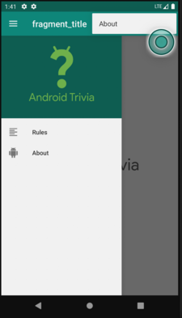

# Trivia_App
## Описание
Векторина с вопросами по Android platfomt
## Цель
Изучить навигацию в Android приложениях
## Использовано
1. Fragments
2. Navigation components
3. Git
4. Android studio
## Внешний вид

